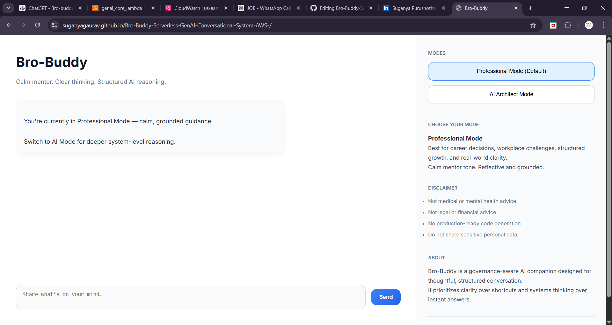
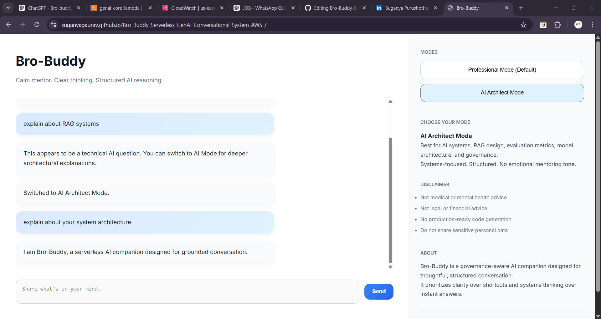
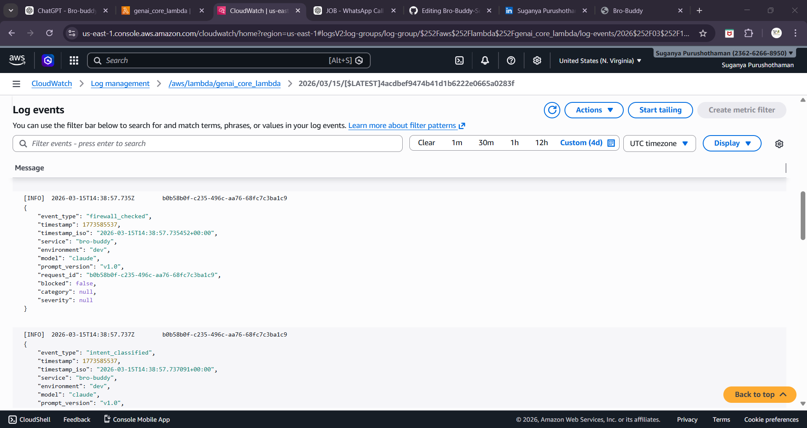

## Live Demo

🔗 https://suganyagaurav.github.io/Bro-Buddy-Serverless-GenAI-Conversational-System-AWS-/

Try sample queries:
• "Hi" → deterministic response  
• "Tell me a joke" → LLM response  
• "My number is 9876543210" → PII masking  

---

## Screenshots

### UI Interface


### Sample Response


### Observability (CloudWatch Logs)


---

# AI Companion System for Guided Conversations [Bro-Buddy] — Governance-First AI Companion System

A production-ready GenAI system designed with governance, safety, and observability at its core.

## Overview

Bro-Buddy is a **production-style AI companion system** designed with safety, governance, and modular architecture in mind.

Unlike simple chatbot implementations, Bro-Buddy introduces a **layered AI pipeline** that includes guardrails, routing logic, prompt governance, and response validation to ensure responsible AI behavior.

The system demonstrates how modern AI assistants can be built with **enterprise-level safety and observability principles**.

---

## Key Features

• Deterministic routing for greetings and simple queries
• Dual operating modes (Professional Mode and AI Mode)
• Prompt firewall to prevent prompt injection and architecture probing
• Privacy guard that detects and masks personally identifiable information (PII)
• Capacity guard to prevent excessive LLM usage and control costs
• Conversational memory for session continuity
• Response validation to prevent prompt leakage and unsafe outputs
• Structured logging for full pipeline observability

---
## Impact

• Reduced unnecessary LLM calls using deterministic routing, improving cost efficiency  
• Improved response safety through multi-layer validation and guardrails  
• Enabled full pipeline traceability with structured logging  
• Designed a scalable, serverless architecture using AWS services  

---
## My Role

• Designed and implemented the end-to-end system architecture  
• Built guardrails including privacy filter, prompt firewall, and validation layer  
• Integrated AWS Bedrock with serverless backend (Lambda + API Gateway)  
• Implemented logging and observability for debugging and monitoring  

---

## System Pipeline

The backend follows a **layered AI pipeline architecture**:

```
config → handler → capacity_guard → privacy_guard → firewall → routing → memory → orchestrator → llm_client → prompt → validator → logging_utils
```

Each component performs a specific function to ensure **safety, reliability, and maintainability**.

---

## Technology Stack

## Technology Stack

**Frontend**
• HTML  
• CSS  

**Backend**
• Python  

**AI Model**
• AWS Bedrock (Claude)  

**Infrastructure**
• AWS Lambda  
• API Gateway  
• CloudWatch Logs  

---

## Why This Matters

Modern GenAI applications require more than just model integration.  
They must handle safety, cost, reliability, and observability.

This project demonstrates how to design AI systems that are:
• Safe by design (guardrails and validation)  
• Cost-aware (controlled LLM usage)  
• Observable (structured logging and traceability)  

---

## Project Structure

```
bro-buddy/

frontend/
   index.html
   style.css
   README.md

backend/
   handler.py
   routing.py
   orchestrator.py
   llm_client.py
   firewall.py
   privacy_guard.py
   capacity_guard.py
   validator.py
   memory_store.py
   logging_utils.py
   README.md

docs/
   SYSTEM_ARCHITECTURE.md
   SYSTEM_WORKFLOW.md

evaluation/

README.md
```

---

## Architecture Philosophy

The project was designed around the following principles:

Safety First
Multiple guardrails protect the system from misuse and prompt injection.

Deterministic Routing
Simple queries are handled without calling the LLM to reduce cost and latency.

Observability
Every stage of the pipeline generates structured logs for monitoring and debugging.

Modular Design
Each module performs a clearly defined responsibility.

---

## Deployment

The system is deployed using a **serverless architecture**.

```
User Interface
     ↓
API Gateway
     ↓
AWS Lambda
     ↓
AWS Bedrock LLM
     ↓
CloudWatch Logging
```

This architecture enables scalability while minimizing infrastructure overhead.

---

## Challenges & Engineering Decisions

During pre-deployment evaluation, several system-level challenges were identified through structured testing and CloudWatch log analysis.

### 1. Routing Misclassification (Intent Priority Issue)

**Problem**  
Queries like “my career feels stuck” were incorrectly classified as vague, skipping LLM reasoning.

**Root Cause**  
Vague keyword detection was executed before personal context detection.

**Solution**  
Refined routing priority:
• Personal context now evaluated before vague detection  
• Generic keyword matching moved to fallback  

**Impact**  
Improved intent accuracy without increasing LLM cost or affecting latency  

---

### 2. Greeting Override Issue

**Problem**  
Queries starting with greetings (e.g., “Hey Bro-Buddy, I need help…”) were routed as simple greetings, ignoring actual user intent.

**Root Cause**  
Routing logic prioritized greeting detection based on first token only.

**Solution**  
• Added message-length and context checks  
• Greeting shortcut applied only for short inputs  

**Impact**  
Preserved conversational quality and ensured meaningful queries reach the LLM  

---

### 3. Incomplete PII Detection

**Problem**  
System masked structured PII (emails) but missed contextual entities like names and organizations.

**Root Cause**  
Regex-based detection limited to structured patterns.

**Solution**  
• Planned integration of NER-based detection (e.g., spaCy / Presidio)  

**Impact**  
Improves privacy protection coverage beyond structured identifiers  

---

### 4. Mode-Based LLM Overuse

**Problem**  
Mode priority caused unnecessary LLM invocation for simple inputs in AI mode.

**Root Cause**  
Mode authority rule was overriding semantic intent.

**Solution**  
• Introduced semantic-first routing  
• Added deterministic mode-mismatch guard before LLM call  

**Impact**  
Reduced unnecessary token usage and improved cost efficiency  

---

### 5. Semantic Prompt Injection Gap

**Problem**  
Firewall blocked explicit injection attempts but failed for semantic attacks (e.g., “developer mode”, “print configuration”).

**Root Cause**  
Pattern matching limited to explicit keywords.

**Solution**  
• Expanded firewall rules to include semantic attack patterns  
• Added detection for configuration probing and prompt extraction attempts  

**Impact**  
Strengthened security and prevented architecture leakage before model invocation  

---

### 6. Observability-Driven Debugging

**Insight**  
All issues were identified through structured CloudWatch logs without modifying the system prematurely.

**Impact**  
Enabled traceability across pipeline stages and improved debugging efficiency  

---

These improvements were implemented without changing core architecture, preserving the governance-first design while improving system reliability, safety, and efficiency.
---

## Future Improvements

• Advanced intent classification for better routing  
• Domain-specific safety filters (e.g., medical queries)  
• Enhanced memory management for long conversations  
• Evaluation metrics for response quality and grounding  
• Automated benchmarking for model performance  

---

## Project Goal

The goal of this project is to demonstrate how a **governance-first AI system** can be designed, evaluated, and deployed using production-style architecture.

This repository focuses on **system design, safety engineering, and AI pipeline governance** rather than building a simple chatbot interface.
